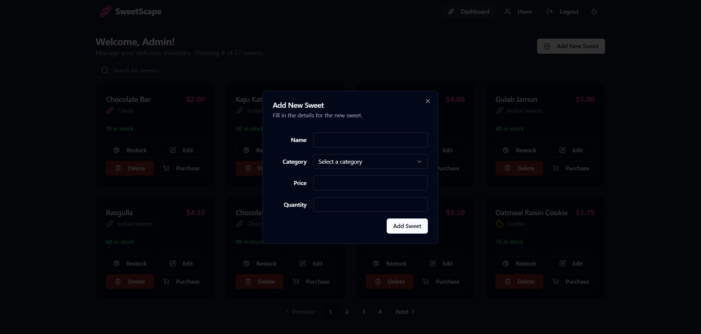

# **Sweet Shop Management System - "SweetScape"**

SweetScape is a full-stack web application designed as a comprehensive management system for a sweet shop. It features a secure, role-based system catering to both customers and administrators, built with a modern technology stack and following Test-Driven Development (TDD) principles.


### **Table of Contents**

1. [Screenshots](#screenshots)  
2. [Features](#features)  
3. [Tech Stack](#tech-stack)  
4. [Setup and Run Instructions](#setup-and-run-instructions)  
5. [Running Tests](#running-tests)  
6. [My AI Usage](#my-ai-usage)

---

## **Screenshots**
#### **Login Page**

#### **Register Page**


#### **Customer Dashboard (Paginated)**


#### **Admin Dashboard (With Admin Controls)**
- **Dashboard**


- **Add New Sweet**


#### **User Management (Admin View)**


---

### **Features**

- **User Authentication:** Secure user registration and login system using JWT (JSON Web Tokens).  
- **Role-Based Access Control:** Distinct UI and API access for two user roles:  
  - **Customer:** Can view and purchase sweets from the inventory.  
  - **Admin:** Has full CRUD (Create, Read, Update, Delete) access over the sweets inventory and can manage user roles.  
- **Sweet Management (Admin):** Admins can add, update, and delete sweets, including setting their name, price, quantity, and category.  
- **Dynamic Category Form:** The "Add/Edit Sweet" form features a dropdown with predefined categories and an option to add a custom category.  
- **Inventory Control:**  
  - Customers can purchase available sweets, which decrements the stock quantity.  
  - Admins can restock any sweet, increasing its quantity.  
- **Pagination & Search:** The main dashboard is fully paginated to handle a large number of sweets efficiently. Users can also perform a real-time search for sweets by name.  
- **User Management (Admin):** A dedicated, admin-only page to view all registered users and promote/demote their roles. Includes safety checks to prevent the deletion of the last admin.  
- **Session Re-validation:** The application automatically verifies user sessions on page load, ensuring that role changes made by an admin are reflected immediately for the user.  
- **Responsive & Themed UI:** A modern, fully responsive interface built with Tailwind CSS and shadcn/ui, featuring a dark/light mode toggle.  
- **Toast Notifications:** Provides clear, non-intrusive feedback for all user actions (login, purchase, errors, etc.).

---

### **Tech Stack**

- **Backend:**  
  - **Framework:** Node.js with Express.js  
  - **Language:** TypeScript  
  - **Database:** MongoDB with Mongoose ODM  
  - **Authentication:** JSON Web Tokens (JWT)  

- **Frontend:**  
  - **Framework:** React (with Vite)  
  - **State Management:** Zustand  
  - **Styling:** Tailwind CSS with shadcn/ui components  
  - **UI/Icons:** Lucide React  

- **Testing:**  
  - **Framework:** Jest with Supertest  
  - **Language:** TypeScript  

---

### **Setup and Run Instructions**

Follow these steps to get the project running on your local machine.

#### **Prerequisites:**

- Node.js (v18 or later recommended)  
- npm (or your preferred package manager)  
- A MongoDB database connection string (you can get a free one from [MongoDB Atlas](https://www.mongodb.com/cloud/atlas))

---

#### **1. Backend Setup**

```bash
# Clone the repository
git clone https://github.com/chandradiproy/tdd-sweet-management-system
cd sweet-shop-management/backend

# Install dependencies
npm install

# Create a .env file in the `backend` directory
touch .env
````

Your `backend/.env` file should look like this:

```env
PORT=5000
MONGO_URI=[Your MongoDB Connection String]
JWT_SECRET=yoursecretkey123
```

```bash
# Run the backend development server
npm run dev
```

The backend server will start on [http://localhost:5000](http://localhost:5000).

---

#### **2. Frontend Setup**

(Open a new terminal window)

```bash
# Navigate to the frontend directory
cd sweet-shop-management/frontend

# Install dependencies
npm install

# Run the frontend development server
npm run dev
```

The frontend application will be available at [http://localhost:5173](http://localhost:5173) (or another port if 5173 is in use).

---

### **Running Tests**

The backend includes a comprehensive test suite to ensure API reliability and security.

To run the tests:

1. Navigate to the backend directory.
2. Ensure the backend server is **not** running in the same terminal.
3. Run the following command:

```bash
npm test
```

You should see an output indicating that all test suites have passed.

**Sample Test Report:**

```
PASS  tests/auth.test.ts  
PASS  tests/users.test.ts  
PASS  tests/sweets.test.ts  

Test Suites: 3 passed, 3 total  
Tests:       27 passed, 27 total  
Snapshots:   0 total  
Time:        15.123 s  
Ran all test suites.
```

---

### **My AI Usage**

In line with the assignment's transparency policy, this section details the use of AI as a development partner throughout this project.

* **AI Tool Used:** **Gemini** (by Google)

* **How I Used It:**

  * **Code Review & Refactoring:** I provided my existing codebase to Gemini, which acted as a senior full-stack developer, to review my code. It identified bugs, suggested improvements, and helped refactor code for better performance and readability.
  * **Debugging:** Gemini was instrumental in debugging several complex issues, including:

    * A race condition in the test setup that caused authentication tests to fail intermittently.
    * A critical bug where users were logged out on every page refresh due to a state initialization loop.
    * Prop-drilling and state management inconsistencies between components.
  * **Feature Implementation:** I collaborated with Gemini to architect and implement new features. This included:

    * Designing the API and frontend logic for pagination.
    * Scaffolding the backend endpoints and frontend UI for the admin-only User Management page.
    * Implementing the category dropdown with a custom "Other" option in the sweet form.
  * **Test Generation:** Gemini helped write and update the Jest/Supertest suites to cover the new backend features, including tests for pagination, validation, and role-based security.
  * **Documentation:** This README.md file was structured and written in collaboration with Gemini to ensure it meets all the assignment's requirements.

* **My Reflection:**
  Using Gemini felt like having an experienced pair programmer available 24/7. It significantly accelerated my workflow by handling boilerplate code, providing instant feedback on my logic, and helping me quickly pinpoint the root cause of bugs that would have otherwise taken much longer to solve. It allowed me to focus more on the application's architecture and user experience rather than getting stuck on minor implementation details. This process has reinforced my belief that AI is an essential tool for modern, efficient, and high-quality software development.
