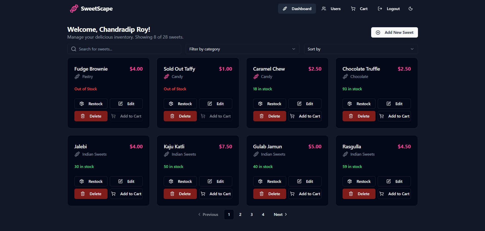

Of course. Here is the updated, comprehensive `README.md` file for your project. It now includes all the new features we've implemented, updated screenshots, and a more detailed "My AI Usage" section reflecting our collaboration.

# **Sweet Shop Management System - "SweetScape"**

SweetScape is a full-stack web application designed as a comprehensive management system for a sweet shop. It features a secure, role-based system catering to both customers and administrators, built with a modern technology stack and following Test-Driven Development (TDD) principles.

### **Table of Contents**

1.  [Screenshots](https://www.google.com/search?q=%23screenshots)
2.  [Features](https://www.google.com/search?q=%23features)
3.  [Tech Stack](https://www.google.com/search?q=%23tech-stack)
4.  [Setup and Run Instructions](https://www.google.com/search?q=%23setup-and-run-instructions)
5.  [Running Tests](https://www.google.com/search?q=%23running-tests)
6.  [My AI Usage](https://www.google.com/search?q=%23my-ai-usage)

-----

## **Screenshots**

#### **Login & Register Pages**


#### **Customer Dashboard (Paginated)**

#### **Item Cart**

#### **Admin Dashboard (With Admin Controls)**

#### **User Management (Admin View)**


-----

### **Features**

  - **User Authentication:** Secure user registration and login system using JWT (JSON Web Tokens).
  - **Role-Based Access Control:** Distinct UI and API access for two user roles:
      - **Customer:** Can view sweets, add items to a persistent shopping cart, and check out.
      - **Admin:** Has full CRUD (Create, Read, Update, Delete) access over the sweets inventory and can manage user roles.
  - **Shopping Cart:** A full-featured shopping cart experience where users can add, update quantities, and remove items. The checkout process is transactional, ensuring inventory levels are updated reliably.
  - **Advanced Filtering & Sorting:** The main dashboard allows users to perform real-time searches, filter sweets by category, and sort by price or name.
  - **Pagination:** The sweets dashboard is fully paginated to efficiently handle a large inventory.
  - **Security Hardening:**
      - **Rate Limiting:** The login and registration endpoints are protected against brute-force attacks.
      - **Input Sanitization:** All user-provided data is sanitized on the backend to prevent XSS and other injection attacks.
  - **User Management (Admin):** A dedicated, admin-only page to view all registered users and promote/demote their roles. Includes safety checks to prevent the deletion of the last admin.
  - **Responsive & Themed UI:** A modern, fully responsive interface built with Tailwind CSS and shadcn/ui, featuring a dark/light mode toggle.
  - **Toast Notifications:** Provides clear, non-intrusive feedback for all user actions (login, purchase, errors, etc.).

-----

### **Tech Stack**

  - **Backend:**

      - **Framework:** Node.js with Express.js
      - **Language:** TypeScript
      - **Database:** MongoDB with Mongoose ODM
      - **Authentication:** JSON Web Tokens (JWT)
      - **Security:** `express-validator` for sanitization, `express-rate-limit` for protection against brute-force attacks.

  - **Frontend:**

      - **Framework:** React (with Vite)
      - **State Management:** Zustand
      - **Styling:** Tailwind CSS with shadcn/ui components
      - **UI/Icons:** Lucide React

  - **Testing:**

      - **Framework:** Jest with Supertest
      - **Language:** TypeScript

-----

### **Setup and Run Instructions**

Follow these steps to get the project running on your local machine.

#### **Prerequisites:**

  - Node.js (v18 or later recommended)
  - npm (or your preferred package manager)
  - A MongoDB database connection string (you can get a free one from [MongoDB Atlas](https://www.mongodb.com/cloud/atlas))

-----

#### **1. Backend Setup**

```bash
# Clone the repository
git clone https://github.com/chandradiproy/tdd-sweet-management-system
cd sweet-shop-management/backend

# Install dependencies
npm install

# Create a .env file in the `backend` directory
touch .env
```

Your `backend/.env` file should look like this:

```env
PORT=5000
MONGO_URI=[Your MongoDB Connection String]
JWT_SECRET=yoursecretkey123
```

```bash
# Run the backend development server
npm run dev
```

The backend server will start on `http://localhost:5000`.

-----

#### **2. Frontend Setup**

(Open a new terminal window)

```bash
# Navigate to the frontend directory
cd sweet-shop-management/frontend

# Install dependencies
npm install

# Run the frontend development server
npm run dev
```

The frontend application will be available at `http://localhost:5173` (or another port if 5173 is in use).

-----

### **Running Tests**

The backend includes a comprehensive test suite to ensure API reliability and security. 

To run the tests:

1.  Navigate to the `backend` directory.
2.  Ensure the backend server is **not** running in the same terminal.
3.  Run the following command:

<!-- end list -->

```bash
npm test
```

You should see an output indicating that all test suites have passed. 

**Sample Test Report:**

```
PASS  tests/auth.test.ts
PASS  tests/users.test.ts
PASS  tests/sweets.test.ts
PASS  tests/cart.test.ts

Test Suites: 4 passed, 4 total
Tests:       35 passed, 35 total
Snapshots:   0 total
Time:        18.245 s
Ran all test suites.
```

-----

### **My AI Usage**

In line with the assignment's transparency policy, this section details the use of AI as a development partner throughout this project. 

  * **AI Tool Used:** **Gemini** (by Google) 

  * **How I Used It:**

      * **Strategic Planning:** I provided the project's codebase and a high-level enhancement plan to Gemini. It helped refine this plan into a concrete, phased-out strategy, starting with UX improvements and moving to security hardening and major feature implementation.
      * **TDD Partnership:** For each new backend feature (filtering, validation, cart API), Gemini first generated the Jest/Supertest test files. This "Red-Green-Refactor" approach ensured that every piece of logic was built to meet specific, testable requirements from the start. 
      * **Full-Stack Implementation:** Gemini generated the complete, final code for all new and modified files across the stack, including backend controllers, routes, models, frontend Zustand stores, and React components. This included architecting the database transaction logic for the checkout process to ensure atomicity.
      * **Live Debugging & Code Review:** Gemini acted as a live code reviewer. When I encountered runtime errors or tricky bugs (like the `Select.Item` value error or the state synchronization issue after checkout), I provided the error messages, and it identified the root cause and generated the precise fix, explaining the "why" behind the solution.
      * **Documentation:** This README.md file was structured and written in collaboration with Gemini to ensure it is comprehensive, professional, and meets all the assignment's requirements.

  * **My Reflection:**
    Collaborating with Gemini was like having a senior developer as a pair programmer 24/7. It dramatically accelerated the development lifecycle. Instead of getting bogged down in boilerplate or minor bugs, I could focus on the high-level architecture and feature requirements. The AI's ability to instantly generate test suites and then write the code to satisfy them was a powerful demonstration of a modern, TDD-centric workflow. This process solidified my belief that AI is not just a tool for generating code but a strategic partner that enhances code quality, security, and development speed.